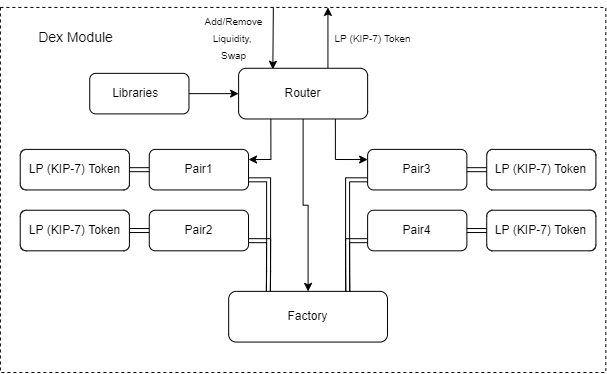
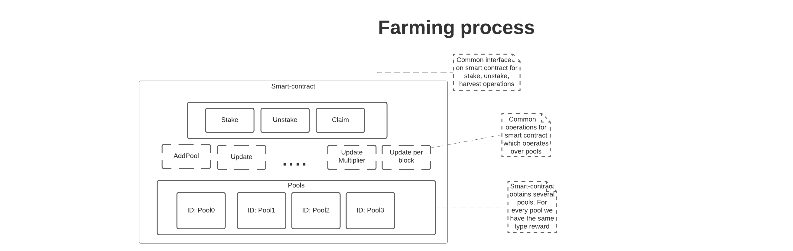
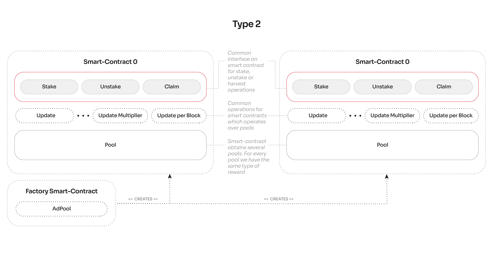

<!-- pdf parameters

---
urlcolor: #e3232c
linkcolor: #e3232c
---

-->

# Klaytn-DEX Specification<!-- omit in toc -->

<!-- start intro: only for github, remove if creating a pdf -->

This document provides detailed specification for the Dex smart contracts, discusses security concerns, and offers the general information about the project needed to better understand its nature.

## Contents<!-- omit in toc -->

- [Introduction](#introduction)
  - [Dex](#dex)
  - [Constant Product Formula](#constant-product-formula)
    - [Invariant](#invariant)
  - [Token Types](#token-types)
    - [ERC20](#erc20)
    - [KIP7](#kip7)
  - [Factory](#factory)
  - [Pair](#pair)
  - [Token Swap](#token-swap)
  - [Liquidity Pool](#liquidity-pool)
  - [Liquidity Provider](#liquidity-provider)
  - [Liquidity Provider Fee](#liquidity-provider-fee)
  - [Pool Tokens](#pool-tokens)
  - [Multisignature wallet](#multisignature-wallet)
- [Smart Contracts](#smart-contracts)
  - [Deployment Order](#deployment-order)
  - [Core](#core)
    - [`DexFactory`](#dexfactory)
      - [Factory Contract: Functions](#factory-contract-functions)
        - [`createPair`](#createpair)
    - [`DexPair`](#dexpair)
      - [Pair Contract: Events](#pair-contract-events)
      - [Pair Contract: Functions](#pair-contract-functions)
        - [`mint`](#mint)
        - [`burn`](#burn)
        - [`swap`](#swap)
  - [Periphery](#periphery)
    - [`DexRouter`](#dexrouter)
      - [Adding Liquidity](#adding-liquidity)
      - [Removing Liquidity](#removing-liquidity)
      - [Swapping tokens](#swapping-tokens)
    - [`DexLibrary`](#dexlibrary)
      - [Library Contract: Functions](#library-contract-functions)
        - [`getAmountOut`](#getamountout)
        - [`getAmountIn`](#getamountin)
  - [Farming and Staking](#farming-and-staking)
    - [`Farming`](#farming)
      - [Allocation Points](#allocation-points)
      - [Farming: PoolInfo](#farming-poolinfo)
      - [Farming: UserInfo](#farming-userinfo)
      - [Farming: Events](#farming-events)
      - [Farming: Reward Debt and Pending Reward](#farming-reward-debt-and-pending-reward)
      - [Farming: Functions](#farming-functions)
        - [Farming: `updatePool`](#farming-updatepool)
        - [Farming: `getMultiplier`](#farming-getmultiplier)
    - [`StakingFactory`](#stakingfactory)
      - [`deployPool`](#deploypool)
    - [`StakingInitializable`](#stakinginitializable)
      - [Staking: PoolInfo](#staking-poolinfo)
      - [Staking: UserInfo](#staking-userinfo)
      - [Staking: Events](#staking-events)
      - [Staking: Reward Debt and Pending Reward](#staking-reward-debt-and-pending-reward)
      - [Staking: Functions](#staking-functions)
        - [Staking: `_getMultiplier`](#staking-_getmultiplier)
        - [Staking: `_updatePool`](#staking-_updatepool)
  - [Access](#access)
    - [`Ownable`](#ownable)
      - [`Ownable`: Functions](#ownable-functions)
    - [`AccessControl`](#accesscontrol)
      - [Roles](#roles)
        - [Admin role](#admin-role)
- [Security Concerns](#security-concerns)
- [Calculations](#calculations)
- [Diagrams](#diagrams)
  - [Type 1 Smart Contract](#type-1-smart-contract)
  - [Type 2 Smart Contract](#type-2-smart-contract)

<!-- end intro: only for github, remove if creating a pdf -->

## Introduction

Below we offer a brief overview of the project design and define the terms used throughout the document.

### Dex

Dex is an automated liquidity protocol powered by a [constant product formula](#constant-product-formula) and implemented in a system of smart contracts. Dex is designed as a highly customizable system, and so it **does not have the tokenomics defined**. Each instance of Dex will define its own tokenomics.

### DEX platform

DEX platform combines [Dex protocol](#dex), which is a system of non-upgradeable smart contracts implemented for the Klaytn blockchain, with other smart contracts, e.g. farming and staking.

### Constant Product Formula

The automated market making algorithm used by [Dex](#dex): `x * y = k`. The formula states that the trades must not change the product (`k`) of a pair's reserve balances (`x` and `y`).

#### Invariant

The `k` value in the [constant product formula](#constant-product-formula) is called **invariant**.

### Token Types

[Dex protocol](#dex) works with ERC20 and KIP7 token standards that implement APIs for fungible tokens within smart contracts.

#### ERC20

[ERC20](https://eips.ethereum.org/EIPS/eip-20) (Ethereum Request for Comments 20) is a token standard that was proposed by Fabian Vogelsteller. Dex supports all standard ERC20 implementations.

#### KIP7

[KIP7](https://kips.klaytn.foundation/KIPs/kip-7) is a fungible token standard for Klaytn. Dex supports all standard KIP7 implementations.

### Factory

Factory is a smart contract that deploys a unique smart contract for any ERC20/ERC20, KIP7/KIP7, ERC20/KIP7, or KIP7/ERC20 [token pair](#pair). See [`DexFactory` contract](#dexfactory) for details.

### Pair

Pair is a smart contract deployed from the Dex Factory that enables trading between any combination of two ERC20 or KIP7 tokens. See [`DexPair` contract](#dexpair) for details.

### Token Swap

Token swaps in Dex are a simple way to trade one ERC-20 or KIP7 token for another. Each pair of tokens on Dex is underpinned by a [liquidity pool](#liquidity-pool).

The [`DexPair`](#dexpair) contract defines the low-level swap function, while the [`DexRouter`](#dexrouter) contract performs the swap operation.

#### `DEXswap`

While DEX contracts ([`DexPair`](#dexpair), [`DexRouter`](#dexrouter), [`Farming`](#farming), [`StakingFactoryPool`](#stakinginitializable), [`StakingFactoty`](#stakingfactory)) do not use `safeTransfer` or `safeTransferFrom` functions from the `DEXswap` token, the `DEXswap` token (its `safeTransfer` and `safeTransferFrom` functions) can be used separately by any user to send tokens to other contracts.

**Warning**: This can lead to re-entrancy attacks from contracts which are not handled by DEX.

The `safeTransfer` and `safeTransferFrom` invoke external call `onKIP7Received` on the recipient address in the `_checkOnKIP7Received` function to verify if the recipient address is a `KIP7Receiver`. This `onKIP7Received(recipient)` call is a weak place. Since it is an external call to an unknown contract, where the recipient contract may define any arbitrary logic to be executed, it is possible to re-enter functions through the use of `safeTransfer` and `safeTransferFrom`.

Users should check the recipient address thoroughly if they want to use these functions. They should check that it doesn't look suspicious to them and doesn't have any malicious code (unverified contracts).

**Warning**: There is also a risk of double-spend allowance when `approve` and `transferFrom` are used. The avoid an attack when changing the allowance value, first set allowance to zero, then verify if it was used before setting the new value.

### Liquidity Pool

Liquidity pools are smart contracts that hold balances of two unique tokens and enforce rules on depositing and withdrawing them. See [Farming and Staking](#farming-and-staking) for more details.

### Liquidity Provider

A liquidity provider is someone who deposits an equivalent value of two ERC20 or KIP7 tokens into a [liquidity pool](#liquidity-pool) for the token pair, and receives [pool tokens](#pool-tokens) in return. Liquidity providers take on a price risk and are compensated with fees.

### Liquidity Provider Fee

Liquidity Provider Fees for swapping tokens is 0.3%, which is split by liquidity providers proportional to their contribution to liquidity reserves.

### Pool Tokens

When liquidity is deposited into a pool, unique tokens known as liquidity tokens (LP tokens) are minted and sent to the provider's address. These tokens represent a given liquidity provider's contribution to a pool.

The number of liquidity tokens the provider receives is determined by the proportion of the pool liquidity that was provided. Refer to the description of the [`mint`](#mint) function for the details.

### Multisignature wallet

Multisignature wallet is a contract that allows multiple parties to agree on proposals for various actions in Dex. The contract allows to submit and confirm proposals. There is also an option to revoke your confirmation (if previously confirmed) from a proposal.

After a certain number of signers confirmed an operation, it can be executed. After the specified condition is met, i.e. the number of signers that confirmed an operation is greater than `min_required`, the proposal is executed automatically during `confirmTransaction` function call. In case of a fail, the proposal could also be executed manually.

## Smart Contracts

Dex uses Uniswap V2 smart contract system, which is a binary system consisting of the core and periphery contracts. [Core contracts](#core) provide fundamental safety guarantees for all parties interacting with Dex. [Periphery contracts](#periphery) interact with one or more core contracts but are not themselves part of the core.

<!-- pdf option: { width=400px } -->

Refer to [factory](#dexfactory), [pair](#dexpair), [router](#dexrouter), [library](#dexlibrary) contracts for their descriptions.

### Deployment Order

Smart contracts are deployed in the following order:

1. WKLAY (needed for testnet)
2. [Dex Factory](#dexfactory)
3. [Dex Router](#dexrouter)
4. [Multisig](#multisignature-wallet)
5. Dex Token
6. [Farming](#farming)
7. [Staking Factory](#stakinginitializable)

### Core

The core consists of a single factory and many pairs that the factory is responsible for creating and indexing. Core contracts are smart contracts that are essential for Uniswap to exist. Upgrading to a new version of core would require a liquidity migration.

The **factory** (`DexFactory`) holds the generic bytecode responsible for powering pairs. Its primary job is to create one and only one smart contract per unique token pair. It also defines the logic to turn on the protocol charge.

The **pairs** (`DexPair`) contracts have two primary purposes: serving as automated market makers and keeping track of pool token balances. They also expose data that can be used to build decentralized price oracles.

#### `DexFactory`

Factory (`DexFactory`) is a smart contract that deploys a unique smart contract ([`DexPair`](#dexpair)) for any ERC20/ERC20, KIP7/KIP7, ERC20/KIP7, or KIP7/ERC20 token pair if such a pair does not already have a smart contract deployed.

The information about the order in which the pairs were deployed is accessible through `allPairs`, which is an array containing addresses of all created pairs.

The contract also manages protocol-wide charge recipient. The `feeTo` defines the address of the protocol-wide charge and `feeToSetter` defines the address that is allowed to change `feeTo`.

##### Factory Contract: Functions

<!-- github table -->

|          Function           |                                                                                                                                                           Description                                                                                                                                                           |
| --------------------------- | ------------------------------------------------------------------------------------------------------------------------------------------------------------------------------------------------------------------------------------------------------------------------------------------------------------------------------- |
| [`createPair`](#createpair) | Create a pair for two given tokens if such a pair doesn't already exist.                                                                                                                                                                                                                                                        |
| `getPair`                   | Return the address of the pair for two given tokens if such a pair exist.                                                                                                                                                                                                                                                       |
| `setFeeToSetter`            | Set the address which is allowed to control protocol-wide charge recipients (`feeTo` addresses). Note that a mistake in the address results in the loss of control over the fee destination as the `feeToSetter` address controls protocol-wide charge recipients.                                                              |
| `setFeeTo`                  | Allow a provided address to control protocol-wide charge recipients. `setFeeTo` сan only be called by the `feeToSetter`, which sets a new address of the protocol-wide charge recipient. Setting the wrong address in the `setFeeTo` function leads to the protocol-wide charge being lost (transferred to that wrong address). |
| `allPairsLength`            | Return the number of created pairs.                                                                                                                                                                                                                                                                                             |


<!-- pdf table

Function                    Description
--------------------------- -------------------------------------------------------------------------
[`createPair`](#createpair) Create a pair for two given tokens if such a pair doesn't already exist.  

`getPair`                   Return the address of the pair for two given tokens if such a pair exist.

`setFeeToSetter`            Set the address which is allowed to control protocol-wide charge
                            recipients (`feeTo` addresses). Note that a mistake in the address
                            results in the loss of control over the fee destination as the
                            `feeToSetter` address controls protocol-wide charge recipients.

`setFeeTo`                  Allow a provided address to control protocol-wide charge recipients.
                            `setFeeTo` сan only be called by the `feeToSetter`, which sets a new
                            address of the protocol-wide charge recipient.
                            Setting the wrong address in the `setFeeTo` function leads to the
                            protocol-wide charge being lost (transferred to that wrong address).

`allPairsLength`            Return the number of created pairs.                                      

--------------------------- -------------------------------------------------------------------------

-->

###### `createPair`

Given the addresses of two tokens, create a pair for these tokens if such a pair doesn't already exist and return the address of the pair. The function emits the `PairCreated` event. The pair can only be created if the provided tokens are different.

The `PairCreated` event contains the addresses of both tokens, the address of the pair, and the cardinal number of the created pair. The first token in the emitted event is guaranteed to be strictly less than the second token by sort order.

#### `DexPair`

Pair (`DexPair`) is a smart contract deployed from the Factory ([`DexFactory`](#dexfactory)) that enables trading between any combination of two ERC20 or KIP7 tokens.

Each Dex smart contract for the token pair manages a [liquidity pool](#liquidity-pool) made up of **reserves** of two ERC-20/KIP-7 tokens. The minimum liquidity for the pair of tokens is defined via `MINIMUM_LIQUIDITY` constant.

The contract holds the following information in the variables: the reserves for both tokens, the timestamp of the latest block, the latest cumulative prices of both tokens, and the value of the `k` [invariant](#invariant) for the pair of tokens calculated as the product of both reserves.

##### Year 2038 Problem <!--omit in toc-->

Pair contracts have a [Year 2038 Problem](https://en.wikipedia.org/wiki/Year_2038_problem). This is due to the `_update` function (used to update reserves and price accumulators) casting the `block.timestamp` to `uint32`, which will wrap around in the year 2038.

This only affects the `price0CumulativeLast` and `price1CumulativeLast` variables (latest cumulative prices of tokens in the pair), which are used for external price reporting. 

This is not detrimental to the DEX functionality. Pair contracts are still going to work after year 2038, but will contain a bug reporting wrong cumulative prices. Other smart contracts relying on this price reporting functionality would not function correctly after the year 2038.

##### Pair Contract: Events

- When liquidity tokens are created via [`mint`](#mint), `Mint` event is emitted with the information about the sender address and the amount of each token in a token pair.
- When liquidity tokens are destroyed via [`burn`](#burn), `Burn` event is emitted with the information about the sender address, the address that received the tokens, and the amount of each token in a token pair.
- When a swap occurs via [`swap`](#swap) operation, `Swap` event is emitted with the addresses of the sender and the recipient, and the amount of tokens swapped and received.
- When reserves are updated as a result of [`mint`](#mint), [`burn`](#burn), and [`swap`](#swap) operations, `Sync` event is emitted with the information about reserves of both tokens in a token pair.

##### Pair Contract: Functions

<!-- github table -->

|    Function     |                                                                                     Description                                                                                      |
| --------------- | ------------------------------------------------------------------------------------------------------------------------------------------------------------------------------------ |
| `initialize`    | Initialize a pair contract. Given the addresses for two tokens, the [factory](#dexfactory) initializes the pair contract. The function is called when the pair contract is deployed. |
| `getReserves`   | Return the reserves of both tokens within the pair as well as the timestamp of the latest block that contained an interaction for this token pair.                                   |
| [`mint`](#mint) | Create pool tokens                                                                                                                                                                   |
| [`burn`](#burn) | Destroy pool tokens                                                                                                                                                                  |
| [`swap`](#swap) | Swap tokens                                                                                                                                                                          |

<!-- pdf table

--------------------------------------------------------------------------------------------------------------------------------------------------------------
Function                    Description
--------------------------- ----------------------------------------------------------------------------------------------------------------------------------
`initialize`                Initialize a pair contract. Given the addresses for two tokens, the [factory](#dexfactory) initializes the pair contract.
                            The function is called when the pair contract is deployed.

`getReserves`               Return the reserves of both tokens within the pair as well as the timestamp
                            of the latest block that contained an interaction for this token pair.                                        

[`mint`](#mint)             Create pool tokens                                                                                                                                                                            

[`burn`](#burn)             Destroy pool tokens                                                                                                                                                                           

[`swap`](#swap)             Swap tokens                                                                                                                                                                                   
--------------------------------------------------------------------------------------------------------------------------------------------------------------

-->

Recovery mechanisms:

<!-- github table -->

| Function |                                                                                                                                                          Description                                                                                                                                                          |
| -------- | ----------------------------------------------------------------------------------------------------------------------------------------------------------------------------------------------------------------------------------------------------------------------------------------------------------------------------- |
| `skim`   | Force balances to match reserves. `skim` is a recovery mechanism in case the amount of tokens sent to a pair is enough to overflow the storages for the reserves, which might cause trades to fail. With `skim`, the user withdraws the difference between the current balance and the reserve.                               |
| `sync`   | Force reserves to match balances. `sync` is a recovery mechanism in case one of the tokens asynchronously deflates the balance of a token pair. If this happens, trades will receive sub-optimal rates and no provider might be willing to rectify the situation,  making the pair stuck and in need of a recovery mechanism. |

<!-- pdf table

-----------------------------------------------------------------------------------------------------------------------------------------------------------
Function                    Description
--------------------------- -------------------------------------------------------------------------------------------------------------------------------
`skim`                      Force balances to match reserves.
                            `skim` is a recovery mechanism in case the amount of tokens sent to a pair is enough to overflow the storages for the reserves,
                            which might cause trades to fail. With `skim`, the user withdraws the difference between the current balance and the reserve.

`sync`                      Force reserves to match balances.
                            `sync` is a recovery mechanism in case one of the tokens asynchronously deflates the balance of a token pair. If this happens,
                            trades will receive sub-optimal rates and no provider might be willing to rectify the situation,
                            making the pair stuck and in need of a recovery mechanism.
-----------------------------------------------------------------------------------------------------------------------------------------------------------

-->

###### `mint`

The `mint` function in the `DexPair` contract is a low-level function that is called for the pair of tokens when liquidity is added via [`DexRouter`](#dexrouter) contract. The `Mint`, `Sync`, `Transfer` events are emitted.

If this is a new pool and there are no [LP tokens](#pool-tokens) yet, then the liquidity is calculated by subtracting `MINIMUM_LIQUIDITY` constant value from the product of minted amounts of both tokens:

```
sqrt(amount0 * amount1) - MINIMUM_LIQUIDITY
```

The first `MINIMUM_LIQUIDITY` tokens in the pool are permanently locked.

Otherwise, if the total supply of LP tokens in the pool is not zero, the liquidity is calculated like this: 

1. Multiply the minted amount of each token by the number of LP tokens in the pool and divide it by the reserve of this token.
2. Pick the minimum of these two values:
   
   ```
   min((amount0 * _totalSupply) / _reserve0, (amount1 * _totalSupply) / _reserve1)
   ```

Minting fee, when it is on, is calculated as follows:
1. Find the [k invariant](#invariant), which is a product of the reserves of both tokens.
2. Find the square roof of the k invariant (`rootK`).
3. If the calculated value (`rootK`) is larger than it used to be (`rootKLast`):

   - Find the growth in the amount of tokens, which is a product of the number of tokens in the pool (`totalSupply`) and the difference in square roots of the current and the previous values of the k invariant `(rootK - rootKLast)`.
   - Find the value of `rootK * 5 + rootKLast`
   - Find the liquidity as the quotient of these two values.

###### `burn`

The `burn` function in the `DexPair` contract is a low-level function that is called for the pair of tokens when liquidity is removed via [`DexRouter`](#dexrouter) contract. The `Burn`, `Sync`, and `Transfer` events are emitted.

For each token in the pair, the amount of tokens to burn is calculated as follows: find the product of the token balance and the liquidity for the pair of tokens, then divide it by the by the number of [LP tokens](#pool-tokens) in the pool. This ensures pro-rata distribution.

###### `swap`

The `swap` function in the `DexPair` contract is a low-level function that is called for the pair of tokens when tokens are swapped via [swap functions](#swapping-tokens) in the `DexRouter` contract. The `Swap` and `Sync` events are emitted.

The swap operation functions in such a way that the tokens must be transferred to pairs **before** the `swap` is called (with the exception of flash swaps). The `swap` function can only be called by another smart contract to ensure this operation is safe.

Refer to [`DexRouter` contract](#swapping-tokens) for more details on how swap works.

**Warning**: `DEXswap` token (its `safeTransfer` and `safeTransferFrom` functions) can be used by any user to send tokens to other contracts. This can lead to re-entrancy attacks from contracts which are not handled by DEX. Refer to [`DEXswap`](#dexswap) for details.

### Periphery

Periphery smart contracts are designed to support domain-specific interactions with the [core](#core). These are external smart contracts that are useful, but not required for Dex to exist. New periphery contracts can always be deployed without migrating liquidity.

The **library** provides a variety of convenience functions for fetching data and pricing.
The **router** fully supports all the basic requirements of a front-end offering trading and liquidity management functionality. It natively supports multi-pair trades and operations with KLAY.

#### `DexRouter`

The contract defines functions for adding and removing liquidity as well as swapping tokens. The contract calls low-level functions defined in the [`DexPair` contract](#dexpair).

##### Adding Liquidity

Functions for adding liquidity for a pair of tokens:

- `addLiquidity` adds liquidity to a pool of any pair of ERC20 or KIP7 tokens (ERC20/ERC20, KIP7/KIP7, ERC20/KIP7, or KIP7/ERC20)
- `addLiquidityKLAY` adds liquidity to a pool of ERC20/WKLAY or KIP7/WKLAY tokens using KLAY (Klaytn native token)

If a pair doesn't already exist, the [`DexFactory`](#dexfactory) contract creates a new pair with exactly the desired amount of tokens.

The functions return the amount of tokens sent to the pool as well as the amount of liquidity tokens that were minted via [`mint`](#mint) from the `DexPair` contract.

##### Removing Liquidity

There are multiple functions for removing liquidity for a pair of tokens:

- `removeLiquidity` removes liquidity from a pool of any pair of ERC20 or KIP7 tokens (ERC20/ERC20, KIP7/KIP7, ERC20/KIP7, or KIP7/ERC20)
- `removeLiquidityKLAY` removes liquidity from a pool of ERC20/WKLAY or KIP7/WKLAY pair (and receive KLAY)
- `removeLiquidityWithPermit` removes liquidity from a pool of any pair of ERC20 or KIP7 tokens (ERC20/ERC20, KIP7/KIP7, ERC20/KIP7, or KIP7/ERC20) without pre-approval
- `removeLiquidityKLAYWithPermit` removes liquidity from a pool of ERC20/WKLAY or KIP7/WKLAY pair (and receive KLAY) without pre-approval
- `removeLiquidityKLAYSupportingFeeOnTransferTokens`
  - same as `removeLiquidityKLAY` but for transfers that take a fee
- `removeLiquidityKLAYWithPermitSupportingFeeOnTransferTokens`
  - same as `removeLiquidityKLAYWithPermit` but for transfers that take a fee

The functions return the amount of tokens received from the pool.

##### Swapping tokens

There are multiple functions for swapping tokens for different kinds of swap operations.

Functions for receiving tokens:

- `swapTokensForExactTokens` receives the exact amount of output tokens for as few input tokens as possible
- `swapTokensForExactKLAY` receives the exact amount of KLAY for as few input tokens as possible
- `swapKLAYForExactTokens` receives the exact amount of tokens for as little KLAY as possible

Functions for sending tokens:

- `swapExactTokensForTokens` swaps the exact amount of input tokens for as many output tokens as possible
- `swapExactKLAYForTokens` swaps the exact amount of KLAY for as many output tokens as possible
- `swapExactTokensForKLAY` swaps the exact amount of tokens for as much ETH as possible
- `swapExactTokensForTokensSupportingFeeOnTransferTokens`
  - same as `swapExactTokensForTokens` but for transfers that take a fee
- `swapExactKLAYForTokensSupportingFeeOnTransferTokens`
  - same as `swapExactKLAYForTokens` but for transfers that take a fee
- `swapExactTokensForKLAYSupportingFeeOnTransferTokens`
  - same as `swapExactTokensForKLAY` but for transfers that take a fee

The swap operation functions in such a way that the tokens must be transferred to pairs **before** the `swap` is called (with the exception of flash swaps). The `swap` function can only be called by another smart contract to ensure this operation is safe.

The pairs check the balances of their tokens at the end of every interaction. Then, at the beginning of the next interaction, current balances are compared against the stored values to determine the amount of tokens that were sent by the current interactor.

One of the input parameters for swap functions is an array of token addresses (`path`) such as that for each consecutive pair of addresses, the pair contract should exist with enough liquidity. The first element is the input token, the last element is the output token. If there is no pair contract for the input and output tokens, then the `path` defines the intermediate pairs to perform the swap operation on.

**Warning**: `DEXswap` token (its `safeTransfer` and `safeTransferFrom` functions) can be used by any user to send tokens to other contracts. This can lead to re-entrancy attacks from contracts which are not handled by DEX. Refer to [`DEXswap`](#dexswap) for details.

#### `DexLibrary`

The `DexLibrary` contract provides a variety of convenience functions for fetching data and pricing.

##### Library Contract: Functions

<!--github table -->

|            Function             |                                                                                                     Description                                                                                                      |
| ------------------------------- | -------------------------------------------------------------------------------------------------------------------------------------------------------------------------------------------------------------------- |
| `sortTokens`                    | Return sorted token addresses for the pair of tokens.                                                                                                                                                                |
| `pairFor`                       | Calculate the CREATE2 address for a pair without making any external calls.                                                                                                                                          |
| `getReserves`                   | Fetch and sort the reserves for a pair.                                                                                                                                                                              |
| `quote`                         | Given the amount of one asset (`amountA`) and the pair reserves (`reserveA`, `reserveB`), return the equivalent amount of another asset (`amountB`). The `amountB` is calculated as `amountA * reserveB / reserveA`. |
| [`getAmountOut`](#getamountout) | Given an input amount of an asset and pair reserves, return the maximum output amount of the other asset.                                                                                                            |
| [`getAmountIn`](#getamountin)   | Given an output amount of an asset and pair reserves, return a required input amount of the other asset.                                                                                                             |
| `getAmountsOut`                 | Perform chained `getAmountOut` calculations on any number of pairs.                                                                                                                                                  |
| `getAmountsIn`                  | Perform chained `getAmountIn` calculations on any number of pairs.                                                                                                                                                   |

<!-- pdf table

--------------------------------------------------------------------------------------------------------------------------
Function                         Description
-------------------------------  -----------------------------------------------------------------------------------------
`sortTokens`                     Return sorted token addresses for the pair of tokens.

`pairFor`                        Calculate the CREATE2 address for a pair without making any external calls.

`getReserves`                    Fetch and sort the reserves for a pair.                                    

`quote`                          Given the amount of one asset (`amountA`) and the pair reserves (`reserveA`, `reserveB`),
                                 return the equivalent amount of another asset (`amountB`).                                 
                                 The `amountB` is calculated as `amountA * reserveB / reserveA`.
 
[`getAmountOut`](#getamountout)  Given an input amount of an asset and pair reserves,
                                 return the maximum output amount of the other asset.                                                                                                            

[`getAmountIn`](#getamountin)    Given an output amount of an asset and pair reserves,
                                 return a required input amount of the other asset.                                                                                                             

`getAmountsOut`                  Perform chained `getAmountOut` calculations on any number of pairs.        

`getAmountsIn`                   Perform chained `getAmountIn` calculations on any number of pairs.
--------------------------------------------------------------------------------------------------------------------------

-->

###### `getAmountOut`

Given an input amount of an asset (`amountIn`) and pair reserves (`reserveIn`, `reserveOut`), the function returns the maximum output amount of the other asset in the pair (`amountOut`).

1. Find the input amount after the fee is calculated. Fee is 0.3%. The adjusted input value (`amountInWithFee`) can be calculated by multiplying the input amount by 997:
   ```
   amountIn * 997
   ```
2. Calculate the product of `amountInWithFee` and the reserve for the other token:
   ```
   amountInWithFee * reserveOut
   ```
3. Find the sum of adjusted input value (`amountInWithFee`) and the reserve of input asset multiplied by 1000 (`reserveIn * 1000`):
   ```
   reserveIn * 1000 + amountInWithFee
   ```
4. To find the output amount, divide the value calculated in step 2 by the value calculated in step 3:
   
   ```
   (amountInWithFee * reserveOut) / (reserveIn * 1000 + amountInWithFee)
   ```

This is the maximum amount of the other asset that could be given for the provided input amount.

###### `getAmountIn`

Given an output amount of an asset (`amountOut`) and pair reserves (`reserveIn`, `reserveOut`), the functions returns the required input amount of the other asset (`amountIn`).

1. Find the product of the output amount (`amountOut`) and the reserve of the other asset (`reserveIn`), then multiply it by `1000`:
   ```
   reserveIn * amountOut * 1000
   ```
2. Subtract the output amount (`amountOut`) from the reserve for this asset (`reserveOut`), then the multiply the result by 997 (the fee is 0.3%):
   ```
   (reserveOut - amountOut) * 997
   ```
3. To find the required input amount, divide the value calculated in step 1 by the value calculated in step 2:
   ```
   (reserveIn * amountOut * 1000) / ((reserveOut - amountOut) * 997)
   ```

### Farming and Staking

Smart contracts for farming activities only support KIP7 standard tokens. Smart contracts for staking activities support both ERC20 and KIP7 standard tokens.

Smart contracts for farming and staking are implemented using two different types of smart contracts. The main difference between the two is in the way the rewards are distributed across pools. 

The `Farming` contract is a [Type 1 smart contract](#type-1-smart-contract). The pools in this type of contract are not independent from one another, there is a single reward pool for all the farming pools within this contract.

The `Staking` contract is a [Type 2 smart contract](#type-2-smart-contract) with pools that are independant from each other in terms of reward distribution.

#### `Farming`

The contract that manages the farming operations with [LP tokens](#pool-tokens). To deploy the contract, the following is needed:

- the address of the platform token, also called **PTN token** (`ptn`)
- the address of the [multisignature contract](#multisignature-wallet), which will own the contract (`multisig`)
- the number of PTN tokens created per block (`ptnPerBlock`)
- the block at which the minting of PTN tokens starts (`startBlock`)

The `Farming` contract defines two structures:

- [`UserInfo`](#farming-userinfo) contains information about each user that stakes LP tokens
- [`PoolInfo`](#farming-poolinfo) contains information about each pool

##### Allocation Points

The number of allocation points assigned to the farming pool is the number of platform tokens to distribute per block.
Total number of allocation points (`totalAllocPoint`) in the farming contract is the sum of all allocation points in all farming pools.

##### Farming: PoolInfo

The structure contains the following information about the pool:

- the address of the LP token contract (`lpToken`)
- the bonus multiplier for the farming pool (`bonusMultiplier`)
- the amount of LP tokens staked in the pool (`totalStaked`)
- the last block in which the PTN tokens were distributed (`lastRewardBlock`)
- the block after which the pool won't get any bonuses from the bonus multiplier for this farming pool (`bonusEndBlock`)
- the accumulated PTN tokens per share multiplied by the `ACC_PRECISION` constant (`accPtnPerShare`)
- the number of [allocation points](#allocation-points) assigned to the pool (`allocPoint`)

##### Farming: UserInfo

The structure contains the information about the amount of LP tokens that the user provided (`amount`) and their reward debt (`rewardDebt`).

See [reward debt calculation](#farming-reward-debt-and-pending-reward).

##### Farming: Events

- When a new pool is added via `add`, `AddPool` is emitted with the id of the pool that was added and the following information: the number of its allocation points, the address of the token, the bonus multiplier for the farming pool, the block after which the pool won't get any bonuses.
- When the number of PTN allocation points for a pool is updated via `set`, `SetPool` is emitted with the id of the pool and the number of its allocation points.
- When rewards for a pool are [updated](#farming-updatepool), `UpdatePool` is emitted with the id of the pool that was updated and the following information: the last block in which PTN tokens are distributed, the number of LP tokens in the pool, and accumulated PTNs per share.
- When LP tokens are deposited via `deposit`, `Deposit` is emitted with the information about the user that made the deposit, the amount of tokens that were deposited and the pool id.
- When LP tokens are withdrawn via `withdraw` or `emergencyWithdraw`, `Withdraw` or `EmergencyWithdraw` is emitted with the information about the user that made the withdrawal, the amount of tokens that were withdrawn and the pool id.
- When the reward per block is updated via `updatePtnPerBlock`, `UpdateRewardPerBlock` is emitted.
- When the multiplier is updated for a pool via `updateMultiplier`, `UpdatePoolMultiplier` is emitted with the id of the pool for which the multiplier was updated and the new multiplier value.

##### Farming: Reward Debt and Pending Reward

**Pending reward** is the number of platform tokens that the user is entitled to receive but have not yet received. To find the pending reward, the `rewardDebt` is subtracted from the product of the amount of LP tokens the user provided (`amount`) and the accumulated PTN tokens per share (`accPtnPerShare`), divided by the `ACC_PRECISION` constant of the farming contract:

```
(user.amount * pool.accPtnPerShare) / ACC_PRECISION - user.rewardDebt
```

Whenever the user `deposit`s or `withdraw`s LP tokens to a pool, the following calculations happen:

1. The `accPtnPerShare` and `lastRewardBlock`) values in the corresponding [pool](#farming-poolinfo) are updated using [`updatePool`](#farming-updatepool) function.
2. The user receives the **pending reward**.
3. The `amount` of LP tokens the user provided is updated.
4. The total number of LP tokens in the pool (`totalStaked`) is updated.
5. The `rewardDebt` for the user is updated. The reward debt is calculated as follows:
   ```
   (user.amount * pool.accPtnPerShare) / ACC_PRECISION
   ```

##### Farming: Functions

<!-- github table -->

|                 Function                  |                                                                                                          Description                                                                                                           |
| ----------------------------------------- | ------------------------------------------------------------------------------------------------------------------------------------------------------------------------------------------------------------------------------ |
| `add`                                     | Add a new LP farming pool. Can only be called by the [`multisig` contract](#multisignature-wallet). A new pool is added based on the address of the LP token, the number of allocation points, and the pool reward multiplier. |
| `deposit`                                 | Deposit the specified amount of LP tokens to the specified pool. See [reward debt and pending reward calculation](#farming-reward-debt-and-pending-reward).                                                                    |
| `withdraw`                                | Withdraw the specified amount of LP tokens from the specified pool. See [reward debt and pending reward calculation](#farming-reward-debt-and-pending-reward).                                                                 |
| `emergencyWithdraw`                       | Withdraw LP tokens from the specified pool without receiving the reward. This is only for emergencies.                                                                                                                         |
| `set`                                     | Update the number of PTN allocation points for the given pool. Can only be called by the [`multisig` contract](#multisignature-wallet).                                                                                        |
| [`updatePool`](#farming-updatepool)       | Update reward variables for the given pool.                                                                                                                                                                                    |
| `massUpdatePools`                         | Update PTN reward for all active pools. The `updatePool` function is called on all pools that are active.                                                                                                                      |
| `updateMultiplier`                        | Update reward multiplier for the specified pool. The `bonusMultiplier` in the `PoolInfo` is updated with the provided value.                                                                                                   |
| `updatePtnPerBlock`                       | Update the number of PTN tokens created per block.                                                                                                                                                                             |
| [`getMultiplier`](#farming-getmultiplier) | Return the reward multiplier between two given blocks for the specified pool.                                                                                                                                                  |
| `safePtnTransfer`                         | Safely transfer the specified amount of PTN tokens to the given address. This is needed in case the rounding error causes a pool to not have enough PTN tokens.                                                                |                                                                                                                                                             |

<!-- pdf table 


---------------------------------------------------------------------------------------------------------------------------------------------
Function                                  Description
----------------------------------------- ---------------------------------------------------------------------------------------------------
`add`                                     Add a new LP farming pool. Can only be called by the [`multisig` contract](#multisignature-wallet).
                                          A new pool is added based on the address of the LP token, the number of allocation points,
                                          and the pool reward multiplier.

`deposit`                                 Deposit the specified amount of LP tokens to the specified pool.
                                          See [reward debt and pending reward calculation](#farming-reward-debt-and-pending-reward).

`withdraw`                                Withdraw the specified amount of LP tokens from the specified pool.
                                          See [reward debt and pending reward calculation](#farming-reward-debt-and-pending-reward).

`emergencyWithdraw`                       Withdraw LP tokens from the specified pool without receiving the reward.
                                          This is only for emergencies.

`set`                                     Update the number of PTN allocation points for the given pool.
                                          Can only be called by the [`multisig` contract](#multisignature-wallet).

[`updatePool`](#farming-updatepool)       Update reward variables for the given pool.

`massUpdatePools`                         Update PTN reward for all active pools.
                                          The `updatePool` function is called on all pools that are active.

`updateMultiplier`                        Update reward multiplier for the specified pool.
                                          The `bonusMultiplier` in the `PoolInfo` is updated with the provided value.

`updatePtnPerBlock`                       Update the number of PTN tokens created per block.

[`getMultiplier`](#farming-getmultiplier) Return the reward multiplier between two given blocks for the specified pool.

`safePtnTransfer`                         Safely transfer the specified amount of PTN tokens to the given address.
                                          This is needed in case the rounding error causes a pool to not have enough PTN tokens.
---------------------------------------------------------------------------------------------------------------------------------------------

-->

###### Farming: `updatePool`

The function updates the reward variables for the given pool.

1. Find the multiplier using [`getMultiplier`](#farming-getmultiplier).
2. Calculate the pending reward:
   - Find the product of the multiplier calculated in the previous step, the number of PTN tokens created per block (`ptnPerBlock`), and the number of allocation points in the pool (`allocPoint`).
   - Divide the resulting value by the total number of allocation points (`totalAllocPoint`, which is the sum of all allocation points in all pools).
3. Update the value for accumulated PTN tokens per share (`accPtnPerShare`):
   - Find the product of pending reward and the `ACC_PRECISION` constant, then divide it by the total number of tokens staked in the pool.
   - Add the resulting value to the current value of `accPtnPerShare`.

Refer to [reward debt and pending reward](#farming-reward-debt-and-pending-reward) for more information.

###### Farming: `getMultiplier`

The function returns the reward multiplier for the farming pool for the given start (`_from`) and end (`_to`) blocks.

The multiplier depends on whether the end block is before or after the `bonusEndBlock`:

- If the end block occurs before `bonusEndBlock`, the multiplier is the product of the `bonusMultiplier` and the difference between the end block and the start block numbers (`_to - _from`).
- If the start block occurs after `bonusEndBlock`, the multiplier is the difference between the end block and the start block numbers `(_to - _from)`.
- In other cases, the multiplier is the sum of the following two values:
  - the product of the the `bonusMultiplier` and the difference between `bonusEndBlock` and the start block numbers `(poolInfo[_pid].bonusEndBlock - _from)`
  - the difference between the start block and `bonusEndBlock`


#### `StakingFactory`

Long-term staking allows users to stake the Dex token and earn other tokens as rewards.

The contract deploys a new staking pool contract using [`deployPool`](#deploypool). The created contract is owned by the [`multisig` contract](#multisignature-wallet).

##### `deployPool`

The contract for the new staking pool is deployed using `StakingInitializable` contract based on the following:

- staked token address
- reward token address
- reward per block (in reward tokens)
- the start and end blocks
- the pool limit per user (in staked tokens)
- the multisig address
- the limit of the number of blocks available for a user

The function returns the address of a new staking pool contract.

#### `StakingInitializable`

The staking factory contract (`StakingFactory`) deploys the `StakingInitializable` contract when a new staking pool is deployed. This contract initializes a new pool.

The contract defines two structures: 
- [`UserInfo`](#staking-userinfo) contains information about each user that stakes tokens
- [`PoolInfo`](#staking-poolinfo) contains information about each staking pool

##### Staking: PoolInfo

The structure contain the following information about the pool:

- whether the pool is initialized 
- the addresses of the staked and reward tokens
- the blocks at which PTN minting starts and ends
- the last block in which the pool was updated
- whether there is a limit set for users
- the max number of blocks available for each user after the start block
- the pool limit (in staked token) per user
- the accrued token per share
- the amount of PTN tokens created per block
- the total amount of staked tokens

##### Staking: UserInfo

The structure contains the information about the amount of staked tokens that the user provided (`amount`) and their reward debt (`rewardDebt`).

##### Staking: Events

- `Deposit` with the information about the user that made the deposit and the deposited amount
- `Withdraw` and `EmergencyWithdraw` with the information about the user that made the withdrawal and the withdrawn amount
- `UpdatePool` with the information about the block that was last updated, the accrued token per share, and the total amount of staked tokens
- `NewStartAndEndBlocks` with the blocks at which PTN minting starts and ends
- `NewRewardPerBlock` with the amount of PTN tokens created per block
- `NewPoolLimit` with the the information about pool limit
- `RewardsStop` with the block at which to stop rewards
- `TokenRecovery` with the information about the user that received recovered tokens and the amount of tokens recovered

##### Staking: Reward Debt and Pending Reward

**Pending reward** is the number of reward tokens that the user is entitled to receive but have not yet received. To find the pending reward, the `rewardDebt` is subtracted from the product of the amount tokens staked by the user and the accrued token per share for the given pool (`accTokenPerShare`), divided by the `PRECISION_FACTOR` constant of the staking contract:

```
(user.amount * pool.accTokenPerShare) / PRECISION_FACTOR - user.rewardDebt
```

Whenever the user `deposit`s or `withdraw`s staked tokens to a pool, the following calculations happen:

1. The `accTokenPerShare` and `lastRewardBlock` values in the corresponding [pool](#staking-poolinfo) are updated using [`_updatePool`](#staking-_updatepool).
2. The user receives the **pending reward**.
3. The `amount` of staked tokens the user provided is updated.
4. The total number of staked tokens in the pool (`totalStaked`) is updated.
5. The `rewardDebt` for the user is updated. The reward debt is calculated as follows:
   ```
   (user.amount * pool.accTokenPerShare) / PRECISION_FACTOR
   ```

##### Staking: Functions

|                  Function                   |                                                    Description                                                     |
| ------------------------------------------- | ------------------------------------------------------------------------------------------------------------------ |
| `initialize`                                | Initialize the staking contract. The contract is owned by the [multisig contract](#multisignature-wallet).         |
| `deposit`                                   | Deposit staked tokens and collect reward tokens (if any).                                                          |
| `withdraw`                                  | Withdraw staked tokens and collect reward tokens (if any).                                                         |
| `recoverToken`                              | Recover tokens sent to the contract by mistake. Can only be called by [multisig contract](#multisignature-wallet). |
| `updatePoolLimitPerUser`                    | Update pool limit per user. Can only be called by [multisig contract](#multisignature-wallet).                     |
| `updateRewardPerBlock`                      | Update reward per block. Can only be called by [multisig contract](#multisignature-wallet).                        |
| `updateStartAndEndBlocks`                   | Update the start and end blocks. Can only be called by [multisig contract](#multisignature-wallet).                |
| [`_updatePool`](#staking-_updatepool)       | Update reward variables for the given pool.                                                                        |
| [`_getMultiplier`](#staking-_getmultiplier) | Return reward multiplier between two given blocks for the specified pool.                                          |
| `hasUserLimit`                              | Check if the user limit is set. (?)                                                                                |

For emergency situations:

<!-- github table -->

|         Function          |                                                     Description                                                     |
| ------------------------- | ------------------------------------------------------------------------------------------------------------------- |
| `emergencyWithdraw`       | Withdraw staked tokens without receiving any rewards.                                                               |
| `emergencyRewardWithdraw` | Transfer reward tokens to the specified address. Can only be called by [multisig contract](#multisignature-wallet). |
| `stopReward`              | Stop pool rewards. Can only be called by [multisig contract](#multisignature-wallet).                               |


<!-- pdf table

---------------------------------------------------------------------------------------------------------------------
Function                   Description
-------------------------  ------------------------------------------------------------------------------------------
`emergencyWithdraw`        Withdraw staked tokens without receiving any rewards.  

`emergencyRewardWithdraw`  Transfer reward tokens to the specified address.
                           Can only be called by [multisig contract](#multisignature-wallet).

`stopReward`               Stop pool rewards. Can only be called by [multisig contract](#multisignature-wallet).
---------------------------------------------------------------------------------------------------------------------

-->

###### Staking: `_getMultiplier`

The functions returns the reward multiplier for the given start (`_from`) and end (`_to`) blocks.

The multiplier depends on the relation between the `rewardEndBlock` (the block at which PTN minting ends) and `_from`/`_to` blocks:

- If the `_to` occurs before `rewardEndBlock`, the multiplier is the difference between the end and the start block numbers (`_to - _from`).
- If the `_from` occurs after `rewardEndBlock`, the multiplier is `0` (rewards are no longer updated).
- In other cases, the multiplier is the difference between the `rewardEndBlock` and the start block numbers (`rewardEndBlock - _from`).


###### Staking: `_updatePool`

The function updates the reward variables for the given pool. If the current block number is higher than `rewardEndBlock` (the block at which PTN minting ends), the pool rewards are no longer updated.

1. Find the multiplier using [`_getMultiplier`](#staking-_getmultiplier).
2. Calculate the pending reward as the product of the multiplier calculated in the previous step and the reward per block (`rewardPerBlock`).
3. Update the value for accrued token per share (`accTokenPerShare`):
   
   - Find the product of pending reward and the `PRECISION_FACTOR` constant, then divide it by the total amount of staked tokens in the pool.
   - Add the resulting value to the current value of `accTokenPerShare`.

Refer to [reward debt and pending reward](#staking-reward-debt-and-pending-reward) for more information.

### Access

[`Ownable`](#ownable) and [`AccessControl`](#accesscontrol) contracts regulate ownership and role-base access to DEX functionality.

Owners and admins are privileged roles. Owners are allowed to modify the contract they own:

- The owner of the [`Farming`](#farming) contract can update pool settings such as allocation points and rewards.
- The owner of the [`StakingFactory](#stakingfactory) can deploy new pools.
- The owner of the ` StakingFactoryPool` can withdraw reward tokens at any time.
- The admin of the `PlatformToken` contract can change who gets to mint and burn tokens.

This poses certain risks associated with the ownership being transferred or renounced, or admin roles being revoked. Check the warnings for the [admin role](#admin-role) and [owners](#ownable-functions).

#### `Ownable`

The `Ownable` contract provides basic access control mechanism: granting accounts exclusive access to specific functions. The account that was granted such exclusive access becomes an **owner** of the specified functionality.

By default, the owner is the account that deploys the contract. The ownership can later be transferred to another account with `transferOwnership`.

##### `Ownable`: Functions

The `Ownable` contract has the following functions:

|      Function       |                                                Description                                                 |
| ------------------- | ---------------------------------------------------------------------------------------------------------- |
| `owner`             | Return the address of the current owner.                                                                   |
| `renounceOwnership` | Leave the contract without an owner. Can only be called by the current owner.                              |
| `transferOwnership` | Transfer ownership of the contract to a new account (`newOwner`). Can only be called by the current owner. |

**Warning**: Renouncing ownership (`renounceOwnership`) leaves the contract without an owner, thereby removing any functionality that is only available to the owner. It will no longer be possible to call `onlyOwner` and all the functions associated with the owner role.

**Warning**: `TransferOwnership` should also be handled carefully. Transferring ownership to the wrong address (e.g. zero address) would also lead to all owner associated functionality being inaccessible.

#### `AccessControl`

The `AccessControl` contract implements role-based access.

<!-- github table  -->

|    Function    |                                                                                        Description                                                                                         |
| -------------- | ------------------------------------------------------------------------------------------------------------------------------------------------------------------------------------------ |
| `hasRole`      | Check if an account has been granted the specified role.                                                                                                                                   |
| `getRoleAdmin` | Return the admin role that controls the specified role.                                                                                                                                    |
| `grantRole`    | Grant the specified role to an account. The caller has to have the admin role.                                                                                                             |
| `revokeRole`   | Revoke the specified role from an account. The caller has to have the admin role. Note that the admin can revoke their own role. If this happens, DEX operator losses control over DEX. |
| `renounceRole` | Revoke the specified role from the calling account. This a mechanism for accounts to lose their privileges if they are compromised, e.g. if a trusted device was misplaced.                |


<!-- pdf table 

--------------------------------------------------------------------------------------------------
Function        Description
--------------  ----------------------------------------------------------------------------------
`hasRole`       Check if an account has been granted the specified role.  

`getRoleAdmin`  Return the admin role that controls the specified role.

`grantRole`     Grant the specified role to an account. The caller has to have the admin role.

`revokeRole`    Revoke the specified role from an account. The caller has to have the admin role.
                Note that the admin can revoke their own role. If this happens,
                DEX operator losses control over DEX.

`renounceRole`  Revoke the specified role from the calling account.
                This a mechanism for accounts to lose their privileges if they are compromised,
                e.g. if a trusted device was misplaced.
--------------------------------------------------------------------------------------------------

-->

##### Roles

Roles are referred to by their `bytes32` identifier. These should be exposed in the external API and be unique. The best way to achieve this is by using `public constant` hash digests:

```
bytes32 public constant MY_ROLE = keccak256("MY_ROLE");
```

Roles can be used to represent a set of permissions. To restrict access to a function call, use `hasRole`:

```
function foo() public {
    require(hasRole(MY_ROLE, msg.sender));
    ...
}
```

Roles can be granted and revoked dynamically via the `grantRole` and `revokeRole` functions. Each role has an associated admin role, and only accounts that have the admin role can call `grantRole` and `revokeRole`.

###### Admin role

By default, the admin role for all roles is `DEFAULT_ADMIN_ROLE`, which means that only accounts with this role will be able to grant or revoke other roles. More complex role relationships can be created by using `_setRoleAdmin`.

The `DEFAULT_ADMIN_ROLE` is also its own admin: it has permission to grant and revoke this role.

**Warning**: With `revokeRole`, the admin can revoke their own role (any granted role). This leads to all functionality associated with the said role being inaccessible. For example, revoking or renouncing `MINTER_ROLE` makes all associated minting functionality inaccessible.

**Warning**: Renouncing or revoking `DEFAULT_ADMIN_ROLE` role leads to the admin no longer being able to grant or revoke any other roles.

## Security Concerns

As mentioned above, there is no tokenomics defined in Dex protocol. Each instance of Dex would need to define and implement its own model, which might mean reworking or completely rewriting the smart contracts.

Reserves and balances should match. In case they do not (e.g. when adding tokens via transfers from outside of DEX platform), there are recovery mechanisms to force reserves and balances to match. These recovery mechanisms are `sync` and `skim` functions defined in [`DexPair` contract](#dexpair).

A lot of functionality on DEX platform is owned and controlled via [`multisig` contract](#multisignature-wallet). This contract is a multisignature wallet that allows multiple parties to agree on transactions before they are executed. However, it is still a single contract controlling other functionality, which means it poses security risks associated with the certain degree of system centralization.

DEX platform has emergency withdraw operations in place to fetch all rewards from a staking pool: `emergencyWithdraw` in both [staking](#stakinginitializable) and [farming](#farming) contracts, and `emergencyRewardWithdraw` in the [staking](#stakinginitializable) contract. The `emergencyRewardWithdraw` is controlled by the [`multisig` contract](#multisignature-wallet).

There are also security concerns common with other decentralized systems. These are intentional attacks such as:

- Sandwich attacks (front-running attack)
- Scam tokens
- Phishing attacks with similarly looking domains
- Pump-and-dump scam
- Arbitrage attacks

## Calculations

This section lists all important calculations within different contracts:

- Pair contract: 
  - [calculate the amount of tokens to mint, minting fee](#mint)
  - [calculate the amount of tokens to burn](#burn)
- Farming contract: 
  - [calculate the multiplier](#farming-getmultiplier)
  - [calculate the reward debt and pending reward](#farming-reward-debt-and-pending-reward)
  - [update reward variables for the pool](#farming-updatepool)
- Staking contract: 
  - [calculate the reward debt and pending reward](#staking-reward-debt-and-pending-reward)
  - [calculate the multiplier](#staking-_getmultiplier)
  - [update reward variables for the pool](#staking-_updatepool)
- Library contract: 
  - [`getAmountIn`](#getamountin)
  - [`getAmountOut`](#getamountout)

## Diagrams

Refer to [Farming and Staking](#farming-and-staking) for details.

### Type 1 Smart Contract

<!-- pdf option: { width=550px } -->

### Type 2 Smart Contract

<!-- pdf option: { width=550px } -->